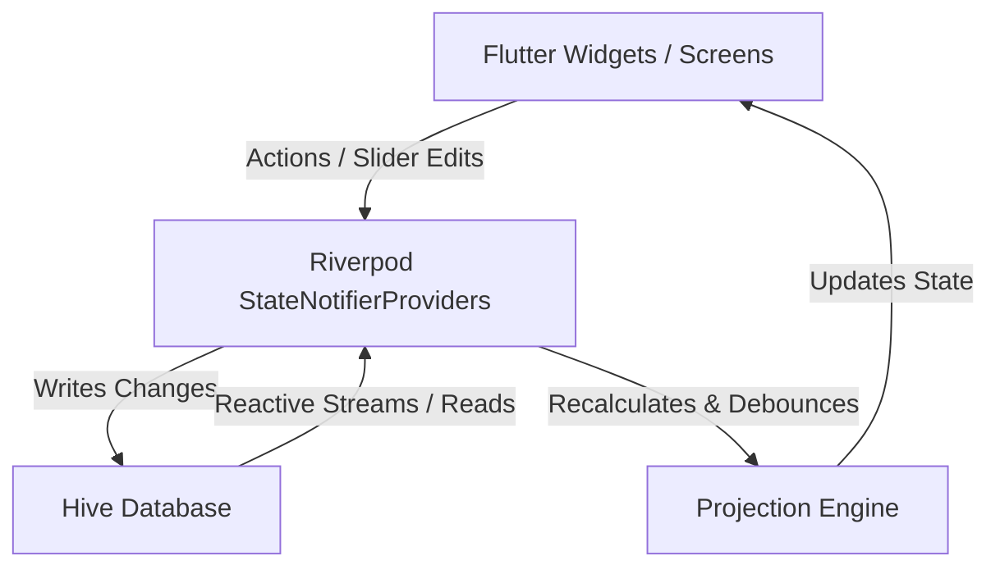

# Ledger — System Architecture & Technical Specifications

This document outlines the architecture, data flow, state management structure, and mathematical engines of Ledger.

---

## 1. System Architecture Overview

Ledger uses a unidirectional data flow architecture powered by Flutter and Riverpod. Local persistence is managed offline using Hive, ensuring absolute privacy for all user configurations and financial parameters.

---

## 2. Model & Storage Layout (Hive TypeAdapters)

All models are plain Dart classes compiled with Hive annotations. They run offline with Type ID registrations:

### 1. `UserProfile` (TypeID: 0)
Stores primary settings, income parameters, and assets/liabilities.
- `startingCtcLpa` (`double`): Gross Annual CTC.
- `annualHikePct` (`double`): Fallback flat salary hike rate.
- `taxRegime` (`String`): `'new'` (FY 2026-27) or `'old'`.
- `cityPreset` (`String`): Expense presets (e.g. `'metro'`).
- `monthlyRent`, `monthlyFood`, `monthlyTransport`, `monthlyMisc` (`double`): Basic expenditures.
- `sipRatePct` (`double`): Planned monthly investment rate.
- `hikeBracketsRaw` (`List<dynamic>`): Stepped career brackets list.
- `emergencyFundBalance` (`double`): Current emergency fund savings.
- `startYear` (`int`): Starting calendar year for projections.
- `otherAssets` (`double`): Additional personal assets.
- `liabilities` (`double`): Active loans/liabilities.

### 2. `Assumptions` (TypeID: 1)
Macroeconomic projection multipliers.
- `sipReturnRate` (`double`): SIP investment compounding growth rate.
- `cashSavingsRate` (`double`): Cash/savings accounts interest rate.
- `expenseInflation` (`double`): Annual inflation index.
- `homeLoanRate` (`double`): Real estate loan interest rate.
- `loanTenureYears` (`int`): Duration of home loans.

### 3. `Goal` (TypeID: 3)
Financial targets (e.g. purchasing a vehicle, down payments, life milestones).
- `id` (`String`): Unique UUID.
- `name` (`String`): Name of the goal.
- `targetAmount` (`double`): Absolute target amount.
- `targetYear` (`int`): Target year relative to starting tracking.
- `type` (`String`): `'standard'` or `'down_payment'`.
- `priority` (`String`): `'high'`, `'medium'`, or `'low'`.
- `adjustForInflation` (`bool`): Toggle inflation adjustments.
- `propertyValue` (`double?`): Value of property if goal is home down payment.
- `downPaymentPct` (`double?`): Percentage of down payment value.

### 4. `RecurringPurchase` (TypeID: 2)
Discretionary cash outflow.
- `id` (`String`): Unique UUID.
- `name` (`String`): Name of the item.
- `amount` (`double`): Cost of purchase.
- `firstYear` (`int`): Year of first occurrence.
- `recurEveryNYears` (`int?`): Cycle of recurrences in years (null if one-time).
- `category` (`String`): Spend category.
- `note` (`String?`): Optional description text.

### 5. `IncomeSource` (TypeID: 4)
Additional active/passive monthly inflows.
- `id` (`String`): Unique UUID.
- `label` (`String`): E.g. "Freelancing".
- `monthlyAmount` (`double`): Active monthly income.
- `annualGrowthPct` (`double`): Growth rate for side income.

---

## 3. State Management Registry (Riverpod)

StateNotifierProviders read from and write to their respective Hive boxes and emit immutable state changes to the UI.

1. **`userProfileProvider`**: Manages user configuration.
2. **`goalsProvider`**: Manages goal lists.
3. **`purchasesProvider`**: Manages recurring expenditures.
4. **`assumptionsProvider`**: Manages calculation assumptions.
5. **`incomeSourcesProvider`**: Manages additional incomes list.
6. **`projectionProvider`**:
   - Class `ProjectionNotifier` watches all state providers.
   - Runs calculations inside a **300ms debounce timer** to prevent UI stuttering during slider drags.
   - Exposes `projectionRecalculatingProvider` (`StateProvider<bool>`) to display Appbar loading states.

---

## 4. Mathematics & Projection Engines

All calculations are located inside the decoupled [finance.dart](file:///c:/Users/dasan/Documents/Finance-Tracker/lib/finance.dart) library.

### 1. Stepped compounded hike computation:
Given career hike brackets:
$$\text{Bracket}_i = \{ \text{fromYear}, \text{toYear}, \text{hikePct} \}$$
CTC at year $y$ is computed sequentially:
$$\text{CTC}_{y} = \text{CTC}_{y-1} \times (1 + \text{hikeRate}(y))$$

### 2. Systematic Withdrawal Plan (SWP):
Sustainable retirement monthly payout is calculated as:
$$\text{Payout}_{\text{sustainable}} = \frac{C \times r_{\text{real}}}{1 - (1 + r_{\text{real}})^{-n}}$$
Where:
- $C$ = Corpus at retirement.
- $r_{\text{real}}$ = Monthly inflation-adjusted real rate of return $\frac{r_{\text{SIP}} - \text{Inflation}}{1 + \text{Inflation}} / 12$.
- $n$ = Total months in retirement (expected years of retirement $\times$ 12).
